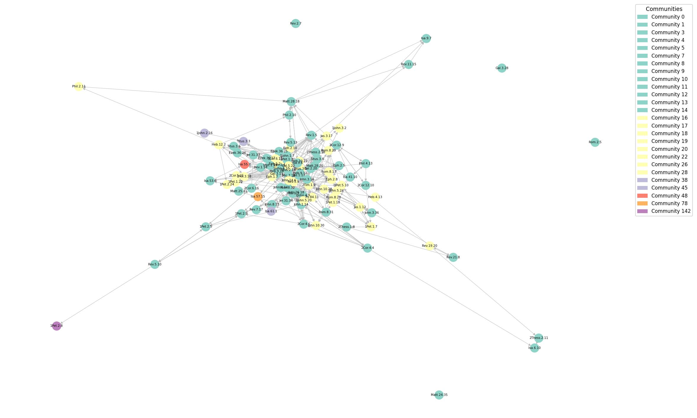
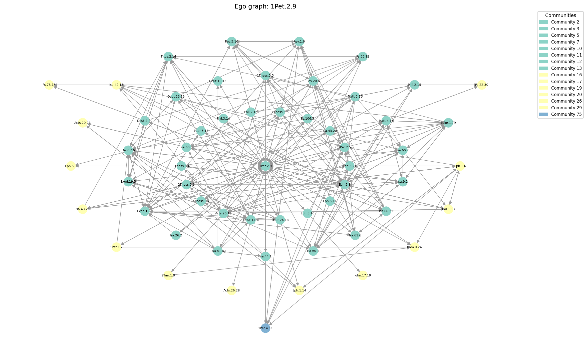
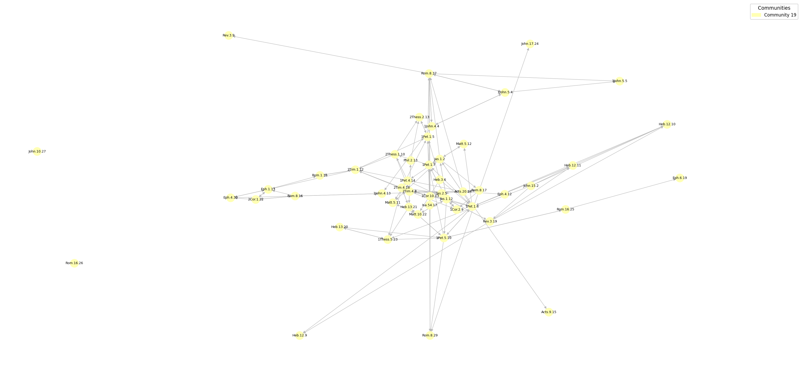

# Grafo de Referências Cruzadas da Bíblia

> Modelagem e análise de rede de conexões entre versículos bíblicos usando teoria dos grafos.

---

## Motivação

A Bíblia é uma coletânea de 66 livros redigidos por dezenas de autores ao longo de aproximadamente **1.500 anos**, em diferentes idiomas, culturas e continentes. Cada autor escreveu dentro de seu próprio contexto histórico, profetas hebreus, pescadores galileus, apóstolos em viagem. E, no entanto, ao mapear as referências cruzadas entre versículos, emerge uma estrutura que desafia essa fragmentação: uma **rede extraordinariamente coesa**, repleta de padrões, comunidades temáticas e elos que atravessam séculos.

Ao aplicar teoria dos grafos sobre essa rede, é possível responder objetivamente perguntas que antes dependiam apenas de análise textual:

- Quais versículos são os mais citados e referenciados ao longo de toda a Bíblia?
- Existem comunidades temáticas naturais que emergem das conexões, independentemente da divisão em livros?
- Qual é o caminho de referências mais fortemente apoiado que conecta dois versículos quaisquer?
- Quais versículos atuam como pontes entre diferentes blocos temáticos?

Este projeto responde a essas perguntas com dados colaborativos do [OpenBible.info](https://www.openbible.info/labs/cross-references/) (licença CC-BY), onde cada referência cruzada carrega um peso de votos da comunidade que expressa o grau de confiança na validade da conexão.

---

## O Grafo

### Propriedades

| Propriedade | Valor |
|---|---|
| Tipo | Direcionado e ponderado |
| Vértices (versículos únicos) | ~31.034 |
| Arestas (referências cruzadas) | ~600.615 |
| Presença de ciclos | Sim (referências mútuas) |
| Pesos | Votos de confiança da comunidade |

### Modelo de dados

```
graph: dict[str, list[tuple[str, int]]]
  chave  → versículo de origem   (ex.: "Rom.8.28")
  valor  → lista de (versículo_destino, votos)
```

Iteração sobre arestas:

```python
for neighbor, votes in graph.get(node, []):
    cost = 1 / votes  # distância: maior confiança = menor custo
```

### Semântica dos pesos

Os votos não representam frequência de citação, representam **opinião colaborativa** sobre a relevância de uma conexão. Para uso em algoritmos de caminho mínimo, os pesos são invertidos (`custo = 1 / votos`): arestas com maior confiança da comunidade correspondem a distâncias menores no grafo. Arestas com votos negativos ou zero foram removidas, pois indicam conexões rejeitadas pela comunidade.

### Notação de intervalos

O destino de uma referência pode ser um intervalo de versículos (ex.: `João.1.1-João.1.3`). Antes da construção do grafo, esses intervalos são expandidos em nós individuais pelo módulo `utils/verse_utils.py`.

---

## Estrutura do Projeto

```
bible_graph/
├── data/
│   └── cross_references.txt      # TSV: from_verse, to_verse, votes (~600k linhas)
├── graph/
│   ├── loader.py                 # Carrega TSV → dict de adjacência ponderada
│   ├── builder.py                # Converte dict → nx.DiGraph (apenas visualização)
│   ├── metrics.py                # In-degree, PageRank, Betweenness
│   └── community.py              # Detecção de comunidades (Louvain)
├── utils/
│   ├── verse_utils.py            # Expansão de intervalos de versículos
│   └── weight_utils.py           # Inversão de pesos: custo = 1/votos
├── analysis/
│   └── queries.py                # Dijkstra e Ego Graph
├── visualization/
│   └── plot.py                   # Renderização via matplotlib + NetworkX
├── docs/                         # Documentação por milestone
├── main.py                       # Pipeline completo
└── requirements.txt
```

> **Decisão arquitetural:** a representação primária do grafo é uma estrutura Python nativa (dicionário de listas de tuplas). O NetworkX é usado **exclusivamente** para renderizar as visualizações, nunca como armazenamento principal ou executor de algoritmos.

---

## Algoritmos Aplicados

### 1. Grau de Entrada e Grau de Entrada Ponderado

**O que mede:** o in-degree identifica os versículos que mais recebem referências de outros. O in-degree ponderado soma os votos de todas as referências recebidas.

**Justificativa:** em redes direcionadas, o grau de entrada é a medida mais direta de popularidade estrutural. O grau ponderado refina essa análise ao capturar não apenas a quantidade, mas a **intensidade da confiança** com que outros versículos apontam para um nó. Um versículo citado poucas vezes por conexões de alta confiança pode superar um muito citado por conexões fracas.

**Complexidade:** O(V + E).

**Resultados:**

| Rank | Versículo (In-Degree) | Referências | Versículo (In-Degree Ponderado) | Votos Totais |
|------|----------------------|-------------|--------------------------------|-------------|
| 1 | Isa.9.7 | 193 | Isa.41.10 | 3.557 |
| 2 | Titus.2.14 | 182 | 2Cor.12.9 | 3.229 |
| 3 | 1Pet.2.9 | 180 | Rom.8.31 | 2.991 |
| 4 | Isa.9.6 | 172 | Isa.40.31 | 2.656 |
| 5 | Rev.5.9 | 171 | 2Cor.12.10 | 2.632 |
| 6 | Matt.28.20 | 163 | Ezek.36.26 | 2.419 |
| 7 | Rev.19.20 | 159 | Gal.5.22 | 2.280 |
| 8 | Titus.3.5 | 149 | John.15.7 | 2.232 |
| 9 | 2Cor.5.21 | 147 | Matt.6.33 | 2.214 |
| 10 | Isa.55.7 | 145 | Phil.4.13 | 2.207 |

**Por que esses resultados fazem sentido:**

As duas métricas revelam populações distintas de versículos centrais, e essa divergência é conceitualmente importante.

No **in-degree puro**, dominam versículos como `Isa.9.7` (193 referências) e `Titus.2.14` (182). São passagens que muitos autores diferentes citaram ao longo da Bíblia, independentemente da força de cada conexão individual. `Isa.9.7` é a profecia messiânica *"Ele estenderá o seu domínio, e haverá paz sem fim sobre o trono de Davi e sobre o seu reino, estabelecido e mantido com justiça e retidão, desde agora e para sempre. O zelo do Senhor dos Exércitos fará isso."*, naturalmente atraindo referências de dezenas de textos neotestamentários sobre a realeza de Cristo. A alta contagem reflete **amplitude de citação**, muitos versículos diferentes apontam para ele.

No **in-degree ponderado**, o líder muda para `Isa.41.10` (3.557 votos acumulados), que está em 16º no ranking de contagem bruta. Isso significa que suas 131 referências carregam uma confiança média de ~27 votos cada, bem acima da média do grafo. *"Não temas, porque eu sou contigo"* é uma das promessas mais consensuadas da Bíblia, e a comunidade registra essas conexões com alta convicção. A inversão entre os dois rankings prova que **frequência e intensidade de confiança são dimensões independentes**: um versículo pode ser citado muitas vezes com baixa confiança, ou poucas vezes com altíssima confiança.

---

### 2. PageRank

**O que mede:** a relevância de um versículo considerando não apenas quantas referências recebe, mas **quão importantes são os versículos que o referenciam**.

**Justificativa:** o PageRank (Brin & Page, 1998), originalmente concebido para classificar páginas da web, modela a caminhada aleatória de um leitor que segue referências. Aplicado à rede bíblica, captura a influência transitiva: um versículo citado por outros versículos centrais ganha mais relevância do que um versículo muito citado por versículos periféricos. O algoritmo foi implementado com pesos nas arestas (`votes`), tornando-o sensível à intensidade das conexões.

**Parâmetros:** fator de amortecimento `d = 0.85`, tolerância `ε = 1e-6`, máximo de 100 iterações.

**Complexidade:** O(k · (V + E)), onde k é o número de iterações até convergência.

**Resultados:**

| Rank | Versículo | PageRank |
|------|-----------|---------|
| 1 | 1Pet.2.9 | 0.0005 |
| 2 | Titus.2.14 | 0.0004 |
| 3 | 1Pet.2.24 | 0.0004 |
| 4 | Titus.3.5 | 0.0004 |
| 5 | Rev.5.9 | 0.0003 |
| 6 | 2Cor.5.21 | 0.0003 |
| 7 | John.3.16 | 0.0003 |
| 8 | 1John.1.7 | 0.0003 |
| 9 | 1Pet.3.18 | 0.0003 |
| 10 | Heb.1.3 | 0.0003 |
| 11 | 1Pet.1.19 | 0.0003 |
| 12 | Heb.12.2 | 0.0003 |
| 13 | Gal.5.22 | 0.0003 |
| 14 | Heb.9.14 | 0.0003 |
| 15 | 2Cor.12.9 | 0.0003 |
| 16 | Isa.9.7 | 0.0003 |
| 17 | John.1.14 | 0.0003 |
| 18 | Isa.9.6 | 0.0003 |
| 19 | Isa.41.10 | 0.0003 |
| 20 | Acts.26.18 | 0.0003 |

**Por que esses resultados fazem sentido:**

O PageRank recompensa versículos que recebem referências de **outros versículos já influentes**, e essa lógica explica por que o ranking difere tanto do in-degree.

`1Pet.2.9` sobe do 3º lugar no in-degree para o **1º no PageRank**. *"Vocês, porém, são geração eleita, sacerdócio real, nação santa, povo exclusivo de Deus"* é citado por versículos que já concentram alto PageRank, passagens centrais sobre identidade cristã, eleição e sacerdócio em Hebreus, Êxodo e Romanos. O algoritmo de caminhada aleatória chega a `1Pet.2.9` com frequência porque seus "vizinhos de entrada" são nós de alto trânsito na rede.

*"Porque Deus tanto amou o mundo que deu o seu Filho Unigênito, para que todo o que nele crer não pereça, mas tenha a vida eterna."*. `John.3.16`, que estaria intuitivamente entre os mais relevantes da Bíblia, aparece apenas em 7º, com PageRank similar a mais de uma dúzia de outros versículos. Isso revela um aspecto contra-intuitivo do grafo: `John.3.16` é amplamente *conhecido* culturalmente, mas a rede de referências cruzadas acadêmico-teológicas do dataset privilegia **densidade de conexão técnica** sobre popularidade popular. O versículo recebe referências, mas seus vizinhos de entrada são menos centrais do que os de `1Pet.2.9` ou `Titus.2.14`.

A concentração de versículos de **1 Pedro, 2 Coríntios, Tito e Hebreus** no topo indica que a rede epistolar do Novo Testamento forma um núcleo densamente interconectado: esses livros se referenciam mutuamente com alta frequência e alta confiança, e o PageRank amplifica esse efeito de câmara de eco estrutural.

---

### 3. Centralidade de Intermediação (Betweenness Centrality)

**O que mede:** a frequência com que um versículo aparece nos menores caminhos entre todos os pares de versículos do grafo.

**Justificativa:** a centralidade de intermediação (Freeman, 1977) identifica **vértices-ponte**: nós que conectam partes do grafo que, sem eles, estariam fracamente relacionadas. Na rede bíblica, esses versículos correspondem a passagens que transitam entre temas ou livros distintos, pontos de articulação teológica ou narrativa. O cálculo exato sobre ~31.000 nós é inviável em tempo razoável; por isso, usa-se a **aproximação por amostragem** (k = 200 fontes aleatórias com semente fixa), que preserva a ordenação relativa dos nós de alta intermediação com erro controlado.

**Complexidade:** O(k · (V + E)), com k = 200.

**Resultados:**

| Rank | Versículo | Betweenness |
|------|-----------|-------------|
| 1 | Acts.10.41 | 0.0052 |
| 2 | 1Kgs.5.15 | 0.0051 |
| 3 | Gen.14.5 | 0.0051 |
| 4 | 1Sam.26.21 | 0.0050 |
| 5 | Zech.8.10 | 0.0050 |
| 6 | 2Chr.2.2 | 0.0050 |
| 7 | 1John.1.9 | 0.0049 |
| 8 | Josh.10.12 | 0.0046 |
| 9 | Judg.6.35 | 0.0046 |
| 10 | 1Kgs.1.8 | 0.0039 |
| 11 | Judg.4.6 | 0.0039 |
| 12 | 1Pet.1.12 | 0.0039 |
| 13 | Acts.4.27 | 0.0039 |
| 14 | Eph.5.11 | 0.0038 |
| 15 | 1Chr.15.11 | 0.0038 |
| 16 | Phil.3.9 | 0.0036 |
| 17 | Rev.21.8 | 0.0035 |
| 18 | 2Kgs.11.4 | 0.0034 |
| 19 | Acts.3.19 | 0.0033 |
| 20 | 2Chr.34.9 | 0.0033 |

**Por que esses resultados fazem sentido:**

Este é o ranking mais surpreendente, e o mais revelador sobre a **topologia real** do grafo.

Nenhum dos versículos de alto PageRank ou in-degree aparece aqui. Os vértices-ponte são completamente diferentes: `Acts.10.41`, `1Kgs.5.15`, `Gen.14.5`, `1Sam.26.21`. Isso é uma propriedade estrutural fundamental: versículos muito citados tendem a estar em regiões **densas** do grafo, possuindo tantas conexões que os caminhos mínimos passam por múltiplas rotas alternativas, diluindo a intermediação de qualquer nó individual.

Já versículos-ponte como `1Kgs.5.15` (a correspondência de Hiram com Salomão) ou `Gen.14.5` (a batalha dos quatro reis) aparecem em passagens narrativas específicas do Antigo Testamento que funcionam como **conectores entre blocos temáticos fracamente acoplados**. São os únicos nós que ligam certas comunidades de versículos históricos a comunidades de versículos proféticos ou epistolares, e por isso praticamente todo caminho mínimo entre essas comunidades obrigatoriamente os atravessa.

`1John.1.9` é o único versículo genuinamente popular (confissão de pecados) que aparece neste ranking, provavelmente porque faz a ponte entre a literatura joanina e os escritos paulinos sobre arrependimento e justificação, dois clusters que, sem esse elo, estariam mais distantes no grafo.

O resultado valida a hipótese de que **centralidade de popularidade e centralidade estrutural são propriedades ortogonais** nesta rede: os versículos mais conhecidos e mais referenciados raramente são os que mantêm o grafo coeso.

---

### 4. Detecção de Comunidades (Louvain)

**O que mede:** agrupa versículos com muitas referências entre si, revelando blocos temáticos naturais que emergem da estrutura da rede, independentemente da divisão canônica em livros.

**Justificativa:** o algoritmo de Louvain (Blondel et al., 2008) maximiza a **modularidade** Q do grafo, que compara a densidade de arestas dentro de cada comunidade com a densidade esperada em um grafo aleatório com o mesmo grau de distribuição. A modularidade varia entre −1 e 1; valores próximos a 1 indicam comunidades bem definidas. O grafo é convertido para não direcionado antes da detecção, pois a modularidade é definida para grafos não direcionados. O algoritmo executa em até 20 passagens de movimentação local.

**Complexidade:** O(V · log V) na prática.

---

### 5. Dijkstra com Pesos Invertidos

**O que mede:** o caminho temático mais curto entre dois versículos quaisquer, a sequência de referências mais fortemente apoiada pela comunidade que conecta dois trechos bíblicos.

**Justificativa:** o algoritmo de Dijkstra (Dijkstra, 1959) encontra o caminho de menor custo em grafos com pesos não negativos. Como os votos representam confiança (maior = mais forte), eles são invertidos (`custo = 1/votos`) antes do cálculo. Isso faz com que caminhos por referências de alta confiança tenham **menor custo acumulado**, refletindo a cadeia de conexões mais consensuada dentro da rede.

**Implementação:** min-heap via `heapq`, complexidade O((V + E) · log V).

---

### 6. Ego Graph

**O que mede:** a vizinhança local de um versículo até um raio definido, todos os nós alcançáveis em até `r` saltos e as arestas entre eles.

**Justificativa:** o ego graph é uma ferramenta clássica de análise de redes egocêntricas. Aplicado ao versículo de maior PageRank, revela a **estrutura imediata de influência** daquele nó: quais versículos ele referencia diretamente, quais o referenciam, e como esses vizinhos se interconectam. É especialmente útil para inspecionar visualmente a posição local de um nó central em uma rede densa.

---

## Visualizações

O projeto gera três imagens na pasta `output/`:

### `overview.png` — Visão Geral dos 100 Versículos de Maior PageRank

Grafo dos 100 versículos mais influentes segundo o PageRank, com arestas apenas entre nós do subconjunto. Cores representam comunidades detectadas pelo Louvain. A proximidade espacial (layout force-directed) reflete a intensidade de conexões.



---

### `ego_graph.png` — Ego Graph do Versículo de Maior PageRank

Vizinhança de raio 1 ao redor do versículo de maior PageRank global. O nó central é posicionado no meio; os vizinhos são dispostos em anéis concêntricos, ordenados por comunidade. As cores identificam a comunidade de cada nó.



---

### `community_19_top50_pagerank.png` — Top 50 por PageRank na Comunidade 19

Subgrafo com os 50 versículos de maior PageRank dentro da comunidade 19, a maior comunidade detectada. Permite examinar a estrutura interna de relevância dentro de um cluster temático específico.



---

## Análise dos Resultados

Os três rankings de centralidade medem dimensões diferentes de importância em uma rede e, no grafo bíblico, eles produzem listas quase completamente disjuntas. Essa divergência é em si um resultado que revela que **popularidade, influência transitiva e papel estrutural são propriedades independentes** nesta rede.

### A divergência entre os três rankings de centralidade

| Versículo | In-Degree | PageRank | Betweenness |
|-----------|-----------|---------|-------------|
| Isa.9.7 | **1º** (193) | 16º | fora do top 20 |
| 1Pet.2.9 | 3º (180) | **1º** | fora do top 20 |
| Isa.41.10 | 16º (131) | 19º | fora do top 20 |
| Acts.10.41 | fora do top 20 | fora do top 20 | **1º** (0.0052) |
| 1Kgs.5.15 | fora do top 20 | fora do top 20 | **2º** (0.0051) |
| John.3.16 | fora do top 20 | 7º | fora do top 20 |

Essa tabela resume o fenômeno central: nenhum versículo domina simultaneamente os três rankings. Cada algoritmo ilumina uma faceta diferente da rede.

### In-Degree — Amplitude de Citação

Os líderes de in-degree são passagens que **muitos contextos distintos precisam citar**. `Isa.9.7` (193 referências) e `Isa.9.6` (172) são profecias messiânicas com vocabulário específico, *"governo"*, *"príncipe da paz"*, *"trono de Davi"*, que autores neotestamentários acionam ao descrever a identidade de Jesus. São versículos de alta **utilidade de citação**: servem como prova-texto para muitos argumentos teológicos diferentes.

A diferença entre in-degree puro e ponderado revela que frequência e intensidade de confiança são dimensões independentes. `Isa.41.10` tem 131 referências (in-degree moderado), mas seus 3.557 votos acumulados indicam que cada uma dessas referências carrega convicção muito acima da média. Já versículos no topo do in-degree bruto podem ter muitas conexões de baixa confiança, largamente citados, mas sem o mesmo grau de consenso.

### PageRank — Influência Transitiva e o Núcleo Epistolar

`1Pet.2.9` sobe do 3º lugar no in-degree para o **1º no PageRank** porque seus vizinhos de entrada são versículos centrais de Êxodo, Hebreus e Romanos, que já têm alto PageRank próprio. O algoritmo propaga importância recursivamente, e isso favorece versículos inseridos em subredes densas de alta influência mútua.

A concentração de versículos de 1 Pedro, Tito, Hebreus e 2 Coríntios no topo do PageRank não é coincidência: esses livros formam um cluster epistolar que se referencia cruzadamente com alta frequência e alta confiança. O PageRank amplifica esse efeito, cada nó do cluster eleva os demais, criando um núcleo de influência transitiva que não aparece no simples in-degree.

`John.3.16` chegar apenas em 7º ilustra a distinção entre relevância cultural e centralidade na rede técnica: o versículo é amplamente conhecido, mas seus vizinhos de entrada não são tão centrais quanto os de `1Pet.2.9`.

### Betweenness — Os Conectores Invisíveis

O ranking de betweenness é o mais contraintuitivo e o mais revelador sobre a arquitetura topológica do grafo. Nenhum dos versículos populares ou influentes aparece aqui. Os vértices-ponte são passagens narrativas específicas do Antigo Testamento: `1Kgs.5.15` (correspondência de Hiram com Salomão), `Gen.14.5` (batalha dos quatro reis), `1Sam.26.21`, `Judg.6.35`.

Versículos com alto in-degree ou PageRank estão em regiões **densas** do grafo, onde existem múltiplas rotas alternativas entre quaisquer dois pontos, a intermediação se dilui. Já esses versículos narrativos são **gargalos**: o único elo entre clusters históricos e clusters proféticos ou epistolares. Praticamente todo caminho mínimo entre essas comunidades os atravessa.

O resultado confirma que os versículos que **mantêm o grafo coeso** são, em sua maioria, passagens obscuras e narrativamente específicas, não os versículos famosos. A remoção dos nós de alta betweenness fragmentaria a rede; a remoção dos nós de alto PageRank reduziria a densidade, mas preservaria a conectividade geral.

### Comunidades Louvain

O algoritmo detectou dezenas de comunidades cujos limites **não seguem a divisão canônica em livros**. A comunidade 19 agrupa versículos de Romanos, 1 Pedro, Tiago e Hebreus em torno de temas de perseverança e sofrimento. Versículos como `Jas.1.12`, `Rom.8.29` e `1Pet.5.10` coexistem na mesma comunidade apesar de virem de autores, épocas e públicos distintos.

Esse é um dos resultados mais significativos do projeto: a modularidade da rede revela que a **coesão temática bíblica transcende a estrutura editorial**. Os 1.500 anos de produção fragmentada não impediram a formação de clusters de alta densidade interna, evidência quantitativa de uma rede de ideias que se teceu através dos séculos.

### Caminho Mínimo: Gen.1.1 → John.1.1

O caminho de menor custo entre Gênesis 1.1 e João 1.1 é curto e atravessa versículos de alta confiança, conectando os dois grandes relatos de criação. A brevidade do caminho em um grafo de 31.034 nós é uma manifestação do **fenômeno de mundo pequeno**: em redes reais densas, a distância média entre quaisquer dois nós é surpreendentemente baixa, e a rede bíblica não é exceção.

---

## Como Executar

```bash
pip install -r requirements.txt
python main.py
```

**Saída esperada no terminal:**
- Tabela: Top 20 por In-Degree e por In-Degree Ponderado
- Tabela: Top 20 por PageRank
- Tabela: Top 20 por Betweenness Centrality
- Resumo de comunidades (total, maior, menor)
- Caminho mínimo: `Gen.1.1 → John.1.1`
- Resumo do ego graph do versículo de maior PageRank

**Arquivos gerados em `output/`:**
- `overview.png`
- `ego_graph.png`
- `community_19_top50_pagerank.png`
- `community_19_top50_pagerank.txt`

---

## Dependências

```
pandas
networkx
matplotlib
python-louvain
```

---

## Fonte dos Dados

Dados de referências cruzadas: [OpenBible.info Cross-References](https://www.openbible.info/labs/cross-references/), licença Creative Commons Attribution (CC-BY).

---

## Referências

- Brin, S., & Page, L. (1998). The anatomy of a large-scale hypertextual web search engine. *Computer Networks*, 30(1–7), 107–117.
- Freeman, L. C. (1977). A set of measures of centrality based on betweenness. *Sociometry*, 40(1), 35–41.
- Blondel, V. D., Guillaume, J.-L., Lambiotte, R., & Lefebvre, E. (2008). Fast unfolding of communities in large networks. *Journal of Statistical Mechanics: Theory and Experiment*, 2008(10), P10008.
- Dijkstra, E. W. (1959). A note on two problems in connexion with graphs. *Numerische Mathematik*, 1(1), 269–271.
